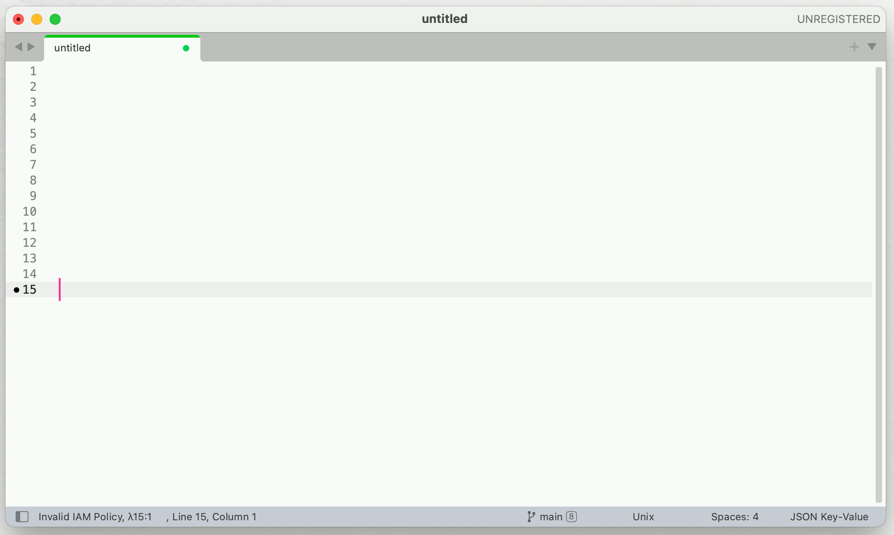

# sublime-aws-helper
`AWS helper` is a Sublime Text plugin to validate the `IAM policy` json for errors.





## Features
- `aws_helper_validate_iam` :  selected text is validated for a valid iam policy json

## How to Use

From Command palette, type `AWS Helper: validate IAM policy`

No default keybinding is provided. Use like below as necessary
```
[
    { "keys": ["ctrl+r"], "command": "aws_helper_validate_iam" }
]
```
## How to Install

### Install with Package Control
Todo

### Setup
It is required to configure AWS with access key ID and secret to use this plugin.

Run `aws configure` to set up your [credentials](https://boto3.amazonaws.com/v1/documentation/api/latest/guide/configuration.html).
They will be stored in` ~/.aws/credentials`.

### TODOs
- [ ] Submit to package control channel
- [ ] Handle network failure from freezing

## FAQ
Todo

### References
[References](resources.md)

### Contributors

<a href="https://github.com/cibinmathew/sublime-aws-helper/graphs/contributors">
  
</a>

### License

[MIT License](./LICENSE)
