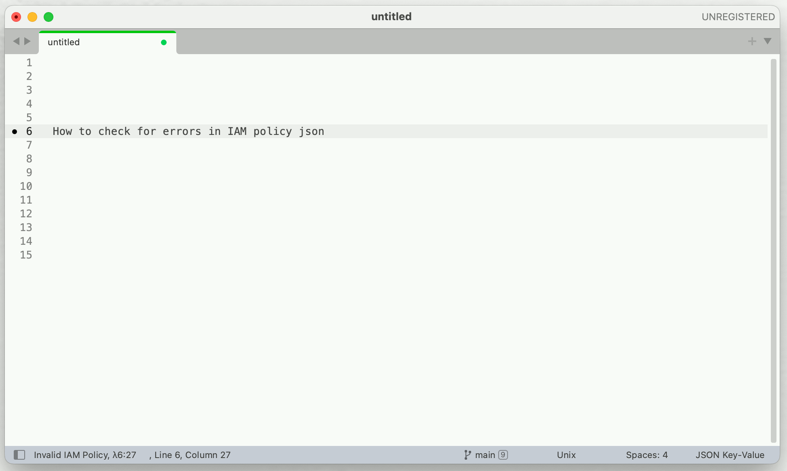

# sublime-aws-helper
`AWS helper` is a [Sublime Text](https://www.sublimetext.com/) plugin to validate the `IAM policy` json for errors. 
Read more at [Medium - AWS Helper: Sublime Text plugin](https://medium.com/@cibin.mathew/aws-helper-sublime-text-plugin-7e5f77fee7d4)





## Features
- `AWS Helper: validate IAM policy` (`aws_helper_validate_iam`) :  selected text is validated for a valid iam policy json. Validtion is done by AWS access-analyzer [ValidatePolicy](https://docs.aws.amazon.com/access-analyzer/latest/APIReference/API_ValidatePolicy.html) API. [[pricing](https://aws.amazon.com/iam/access-analyzer/pricing/)]
- `AWS Helper: open arn in console` (`aws_helper_open_arn_in_console`) : For supported aws services, if the selected text matches an arn, the corresponding aws console url for the same is opened in default browser.


## How to Use

From Command palette, type the command, eg: `AWS Helper: validate IAM policy`

No default keybinding is provided. Use like below as necessary
```
[
    { "keys": ["ctrl+r"], "command": "aws_helper_validate_iam" }
]
```
## How to Install

### Install with Package Control
To Install [AWS Helper](https://packagecontrol.io/packages/AWS%20Helper) via [Package Control](https://packagecontrol.io/). 
- Search for package: `AWS Helper`
### Manual
- Open the Sublime Text Packages folder (see Sublime Text > Preferences > Browse Packages...)
- Clone this repo
- Restart Sublime Text
### Setup
It is required to configure AWS with access key ID and secret to use this plugin.

Run `aws configure` to set up your [credentials](https://boto3.amazonaws.com/v1/documentation/api/latest/guide/configuration.html).
They will be stored in` ~/.aws/credentials`.

### TODOs
- [x] Submit to package control channel
- [ ] Handle network failure from freezing

## FAQ
Todo

### References
[References](resources.md)

### Contributors

<a href="https://github.com/cibinmathew/sublime-aws-helper/graphs/contributors">
  
</a>

### License

[MIT License](./LICENSE)
